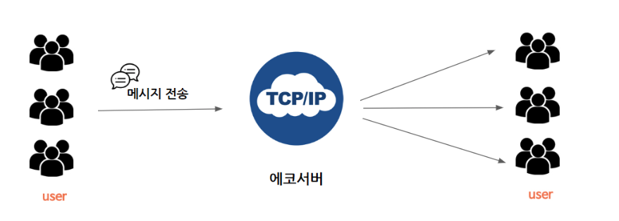
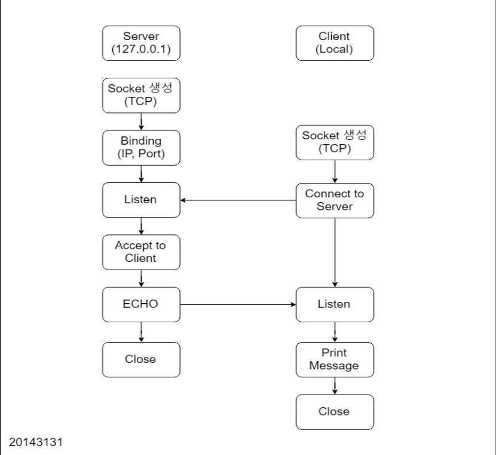

# TCP 에코 서버 및 클라이언트

TCP(Transmission Control Protocol) 및 UDP(User Datagram Protocol)를 사용하는 에코서버 및 클라이언트의 어떻게 동작하는 지 원리를 이해하고 한 번에 하나의 클라이언트와 통신이 가능한 TCP 에코 서버 및 클라이언트 프로그램을 작성한다. UDP 에코서버에서 클라이언트와 서버가 작동하는 방식과 TCP 기반 프로그램에서 동작했을 때의 차이점에 대해 이해한다.

- TCP 에코 서버/클라이언트 동작 원리 및 기능 검증
- UDP 에코 서버 및 클라이언트 프로그램을 작성했을 때, TCP 기반 프로그램과의 차이점

# 클라이언트

에코서버에게 메시지와 메시지 길이를 전송하고 에코를 통해 서버에게 전달했었던 메시지를 전달 받기 위한 클라이언트를 제작한다.

클라이언트는 총 5가지 동작을 진행한다.

1. 클라이언트가 네트워크를 통해 서버에게 메시지를 전달하고 에코를 받을 수 있도록 TCP 프로토콜을 사용하는 소켓을 열고 초기화를 진행한다.(Socket Initialization)
2. 초기화 된 소켓 구조체에 접속할 서버의 IP 주소 및 포트 번호를 지정한다.
3. 소켓을 이용하여 보낼 메시지, 메시지 길이를 서버에 전송한다.(Connect)
4. 서버에서 에코가 올 경우, 에코를 받아 버퍼에 저장한다.
5. 연결 종료한다.

# 에코서버

클라이언트가 전송한 메시지를 확인한 후에 다시 클라이언트에게 받았던 메시지를 보내는 서버를 제작한다.

에코서버 동작은 총 6가지를 거친다.

1. 클라이언트에 대해 TCP 프로토콜을 사용하여 통신할 수 있도록 서버에 소켓을 열고 초기화를 진행한다.(Socket Initialization)
2. 초기화 된 소켓 구조체에 IP 주소 및 IP 접속 범위(0.0.0.0), 접속 포트 번호를 지정한다.(Binding)
3. 클라이언트가 서버에 통신할 때까지 대기한다.(Listen)
4. 클라이언트가 서버에 성공적으로 접속할 경우, 클라이언트 접속 정보를 서버 내 구조체에 저장하고 메시지는 버퍼에 저장한다.(Connect)
5. 서버는 클라이언트 접속 정보를 사용해 에코를 보낸다.(ECHO)
6. 서버 사용을 안할 경우, 연결 종료한다.



> 그림1. 에코서버 동작 개요



> 그림2. 에코서버 동작 블록도

# 클라이언트 - 에코서버 실행

에코서버 및 클라이언트의 동작 원리를 바탕으로 소켓 프로그래밍을 진행한다. 코드 디버깅 이후 에코서버와 클라이언트 간의 통신이 올바르게 이루어지는 지 확인한다.

프로그램 작성 시 사용한 시스템의 제원(검증 환경)은 다음과 같다.

| 제원     | 값        |
| -------- | --------- |
| OS       | MacOS     |
| Language | Python    |
| Version  | 3.7.0     |
| IP       | localhost |


## 에코 서버

에코 서버 구현은 `python` 라이브러리에 있는 `socketserver`를 사용하였다. Main에서는 IP, Port, 핸들러를 파라미터로 한 `TCPServer`를 호출하고 요청을 대기한다. 핸들러는 `socketserver.BaseRequestHandler` 내 `handle` 을 오버라이딩하여 사용한다. `handle` 내 서버에서 실행될 작업을 작성한다.

```python
import socketserver
import sys

class Server(socketserver.BaseRequestHandler):
    # handle에서 서버에서 실행될 작업 작성
    def handle(self):
        print('Client is connected: {0}'.format(self.client_address[0]))
        sock = self.request

        buffer = sock.recv(1024)
        receivedMessage = str(buffer, encoding='utf-8')
        print('Received: {0}'.format(receivedMessage))

        sock.send(buffer)
        sock.close()

if __name__ == '__main__':
    bindIP = '127.0.0.1'  # localhost
    bindPort = 10070

    server = socketserver.TCPServer((bindIP, bindPort), Server)

    print("Start Echo-Server")
    server.serve_forever()  # 요청 대기
```

## 클라이언트

클라이언트는 파이썬 라이브러리인 `socket` 을 사용하여 서버에 연결하였다.

```python
import socket
import sys

serverPort = 10070

if __name__ == "__main__":
    bindIP = '127.0.0.1'  # localhost
    serverIP = '127.0.0.1'  # localhost
    message = sys.argv[1]

    sock = socket.socket(socket.AF_INET, socket.SOCK_STREAM) # 소켓 객체 생성
    sock.bind((bindIP, 0)) # 바인딩

    try:
        sock.connect((serverIP, serverPort)) # 소켓 연결

        buffer = bytes(message, encoding='utf-8')
        sock.send(buffer) # 메시지 전송

        print('Sended message: {0}'.format(message))

        buffer = sock.recv(1024) # echo
        receivedMessage = str(buffer, encoding='utf-8')
        print('Received message: {0}'.format(receivedMessage))

    finally:
        sock.close()
```

# UDP 에코서버

UDP(User Datagram Protocol)에서도 클라이언트와 서버를 사용하는 에코서버를 생성할 수 있다. TCP와 비교했을 때 동작원리가 달라 공통점과 차이점이 존재하게 된다.

**공통점**

- 데이터 전송 시 receiver의 정보(IP, Port)가 필요하다.
- 올바른 데이터가 전송되었는지 확인하기 위한 Checksum을 실행한다.

**차이점**

- TCP에서는 Connection-Oriented 방식으로 데이터를 전송하기 때문에 Sender와 Receiver가 연결을 확인해야지 데이터 전송을 시작하지만 UDP에서는 Connectionless 방식으로 데이터를 전송하므로 상대방의 의사여부 없이 데이터를 전송한다.
- TCP에서는 Reliable Data Transfer를 보장하지만 UDP에서는 이와 같은 내용은 보장해주지 않아서 전송하는 도중에 데이터가 손실되거나 순서가 변경되어도 다시 보내지 않는다.
- UDP는 Flow Control를 하지 않고 버퍼 오버플로우가 발생해도 데이터 손실에 대한 책임은 지지 않는다.
- UDP는 Reliable Data Transfer를 지원하지 않으므로 Sender와 Receiver 간의 데이터가 올바르게 갔는 지 확인하는 작업은 하지 않으므로 TCP보다 속도가 빠르다.
- TCP는 상대방과 “1:1”(Unicast)로만 통신이 가능하지만 UDP는 “1:1”(Unicast), “1:N”(Broadcast), “N:M” (Multicast) 를 지원한다.

**TCP 에코서버와 UDP 에코서버 비교**

| 항목                           | TCP                 | UDP                           |
| ------------------------------ | ------------------- | ----------------------------- |
| IP, Port required, Checksum    | O                   | O                             |
| Connection                     | Connection-Oriented | Connectionless                |
| Reliable Data Transfer         | O                   | X                             |
| Flow control & Congest control | O                   | X                             |
| data transfer rate             | ↓                   | ↑                             |
| Cast                           | Unicast             | Unicast, Broadcast, Multicast |

# 결론

에코서버 및 클라이언트가 작동하는 원리에 대해 알아보았고, C로 프로그래밍하여 실제로 클라이언트와 에코서버간의 통신을 하는 과정을 보았다. 그리고 UDP 에코서버와 통신 시 작성한 TCP 에코서버와 어떤 부분이 차이가 있었는 지 평소에 수업에서 배웠던 내용들을 기억하면서 차이점을 작성하였다. 서비스하려는 방식에 따라 TCP와 UDP를 적재적소에 선택하는게 중요하다.

# Reference

**socket**

- [https://docs.python.org/ko/3.7/library/socket.html](https://docs.python.org/ko/3.7/library/socket.html)
- [https://soooprmx.com/archives/8737](https://soooprmx.com/archives/8737)

**socketserver**

- [https://python.flowdas.com/library/socketserver.html](https://python.flowdas.com/library/socketserver.html)