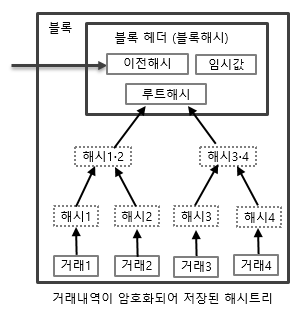
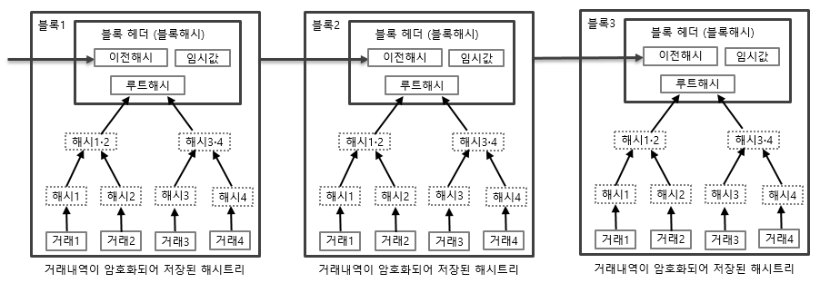
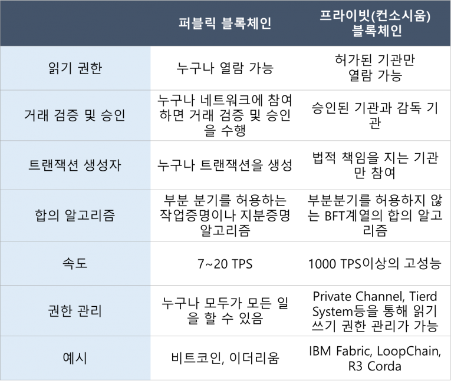

# 블록체인 개요

Created: Apr 24, 2020 11:51 AM
Tags: Blockchain

# 개요

**분산 원장 기술**, **다수의 거래 내역을 묶어 하나의 데이터 블록을 구성하고 해시를 이용하여 이러한 블록들을 체인으로 연결한 뒤 다수의 사람들에게 복사하여 분산 저장하는 기술**이다. 다수의 사람들에게 복사, 분산 저장하기 때문에 데이터의 위, 변조가 불가능하여 신뢰할 수 있는 데이터 처리가 가능하다.

# 특징

## 신뢰성

- 블록체인에 기록된 데이터는 해킹을 통한 위변조가 매우 어렵기 때문에 누구나 신뢰할 수 있다.
- 블록체인 자체를 해킹하는 유일한 방법은 전체 네트워크의 50% 이상에 해당하는 해시 연산 능력을 보유하고, 다른 노드보다 더 빠른 속도로 신규 블록을 생성하여 네트워크에 전파함으로써, 다른 노드들이 정상적인 데이터가 아니라 위변조된 데이터를 포함한 블록체인을 채택하도록 만들어야 한다.

## 안전성

- 블록체인에 기록된 데이터는 분산 저장하기 때문에, 특정 노드에 대한 디도스 공격이나 랜섬웨어 공격 등으로부터 안전하다.
- 블록체인 네트워크에 참여하는 특정 노드를 공격하여 해당 시스템을 마비시키더라도, 다른 노드에 있는 서버 컴퓨터들이 정상 작동하기 때문에 서비스를 안정적으로 제공할 수 있다.

## 탈중앙화

- 중앙이 없는 P2P(Peer to Peer) 방식으로 운영되기 때문에, 중계 기관이 존재하지 않는다.
- 블록체인 방식이 사회적으로 널리 퍼지면 기존의 중앙집중식 조직은 악화되거나 소멸된다.

# 작동 원리

블록체인 네트워크에서 새로운 거래가 발생할 경우, 그 내역은 네트워크에 연결된 모든 노드들에게 알려진다. 각 노드들은 일정한 시간동안 이루어진 모든 거래를 하나로 묶어 새로운 블록을 구성, 목표값 이하의 해시값을 찾기 위해 경쟁한다. 가장 먼저 찾은 노드는 경쟁에서 승리하게 되고 이를 전체 네트워크에 다시금 알린다.

이 때, 새로 생성된 블록의 유효성을 검사하고 이상이 없을 경우 새로운 블럭 생성을 승인하여, 정식 블록으로서 블록체인에 추가된다. 만약 동시에 서로 다른 거래내역을 가진 블록이 생성될 경우, 네트워크는 한시간 정도 기다리면서 가장 긴 길이를 가진 체인을 선택하여 연결한다. 이 때 선택되지 않은 블록은 고아 블록(Orphan Block)이 된다.

## 1. 블록 구성

거래의 최소 단위는 **트랜잭션**이라고 하며, 트랜잭션이란 **더 이상 쪼갤 수 없는 업무 처리의 최소 단위**를 말한다. 블록체인에서 이러한 거래내역은 **해쉬 함수**를 이용하여 암호화된다. 거래내역을 단순히 텍스트로만 표시한다면 그 길이가 각각 다르지만 해시 함수를 이용하면 이러한 다양한 길이를 가진 데이터를 고정된 데이터로서 변환할 수 있다.

SHA-256 함수를 이용하면 거래 내역의 길이와 상관없이 2진수로 256자리의 고정된 길이를 가진 값으로 변환하게 된다. 해시함수를 거친 거래내역들을 여러 개 묶어 하나의 블록을 형성한다. 거래내역의 개수와 상관없이 일정한 시간에 한번씩 블록을 생성한다.

하나의 블록에는 모든 하위 해시를 다시 해시 함수를 통하여 변환한 값이 루트 해시 값이 하나 존재한다. 루트 해시를 생성하기 위해선  1개의 거래내역에 해당하는 해시값과 다른 1개의 해시값이 해시 연산을 통하여 새로운 상위 해시를 생성해내는 것이다. 이런 방식이 지속적으로 진행하게 된다. 이 때 해시의 개수가 홀수라면 자기 자신과 해시 연산을 수행한다. 이렇게 반복적으로 해시연산 과정을 거치게 되면 트리 구조에 최상위 지점에는 단 하나의 루트 해시만 남게 된다. 이러한 해시 구조를 해시트리 또는 머클트리라고 한다.

해시의 특성상 거래내역 중 단 한 부분만 변경되더라도 모든 해시의 값들이 변경되기 때문에 데이터의 위변조 되었는지 즉시 확인이 가능하다.

이런 과정을 통하여 새로 구성된 블록은 타임 스탬프 서버에 의해 생성된 시간이 기록되며, 전체 네트워크에 전파한다. 타임스템프란 전자문서가 특정한 시점에 존재하고 있었다는 '존재증명'과 그 이후 데이터가 위변조되지 않았다는 '내용증명'을 해주는 일종의 전자도장이다.

> 그림 1. 블록 내 해시 트리 구조(출처: 해쉬넷)

## 2. 체인 연결

하나의 새로운 블록이 구성되었다면 다음으로 이전에 있었던 블록체인의 맨 끝에 생성된 새로운 블록을 연결시켜야 한다. 이를 하려면 기존의 있던 블록의 해시값을 찾아내야한다. 새로운 해시값을 성공적으로 찾아내는 경우, 기존 블록체인에 연결한다.

블록의 해시값은 해당 블록의 생성일시, 버전, 루트해시, 이전 블록의 해시, 그리고 논스라고 하는 임시값 등을 조합한 후 해시로 변환하여 생성한다. 논스 값을 지속적으로 바꿔가면서 새로 생성된 해시값이 목표값보다 더 작을 경우에 새로운 블록이 성공적으로 생성된다. 

이렇게 특정한 블록에 대해 목표값 이하의 크기를 가진 해시값을 찾아 새로운 블록을 생성하는 행위를 작업증명(POW)이라고 한다. 작업증명의 대가로 일정한 개수의 암호화폐를 지급받는 것을 채굴, 마이닝이라고 한다. 

> 그림 2. 해시 값을 통한 블록 연결(출처: 해쉬넷)

## 3. P2P 분산 저장

P2P는 Peer to Peer이란 뜻으로 인터넷을 통해 연결된 다수의 사용자들이 직접 데이터를 주고 받는 것을 말한다. 이러한 P2P 방식은 서버-클라이언트 방식과는 다르게 한 동료가 다른 동료(Peer)에게 데이터를 직접 전송하는 시스템을 말한다. 기존 시스템은 서버가 중심이고 클라이언트는 종속적이게 되지만 블록체인은 이러한 P2P 방식이기 때문에 모든 Peer가 동등한 위치에 있다.

블록체인에 저장된 데이터는 네트워크에 연결된 모든 사용자들에게 복사, 분산저장되는데 이 때 각 개체들을 노드(Node)라고 한다.

그리고 복사, 분산저장된 정보는 모두 동일한데 어떤 것이 원본인지 사본인지에 대한 구별은 없다. 네트워크 데이터 전체 100%를 동일하게 복사하여 저장한 노드를 풀 노드(Full Node)라고 하며 이 데이터의 일부만을 복사하여 저장한 노드를 라이트 노드(Light Node)라고 한다.

# 블록체인 종류

## 퍼블릭 블록체인

- 누구든지 자유롭게 참여할 수 있는 개방형 블록체인 네트워크이다.
- 조직의 승인없이 누구든지 인터넷에 연결된 컴퓨터 장비를 이용하여 블록체인 네트워크에 참여 및 탈퇴 할 수 있다.
- 참여자들의 컴퓨터 사용에 따른 전기료 등 운영 비용을 감당할 수 있도록, 암호화폐를 발행하여 보상한다.

## 프라이빗 블록체인

- 미리 정해진 조직이나 개인들만 참여할 수 있는 폐쇄형 블록체인 네트워크이다.
- 참여하기 위해선 해당 네트워크의 관리자에게 승인을 받아야 한다.
- 내부의 목적에 따른 사용이 아니면 암호화폐를 발행하지 않아도 된다.

## 하이브리드 블록체인

- 퍼블릭 블록체인과 프라이빗 블록체인을 서로 연결하거나 섞은 혼합형 블록체인을 말한다.
- 보안이 중요한 가정용 사물인터넷(IoT) 기기는 프라이빗 블록체인을 이용하고, 자동화된 결제를 위해 퍼블릭 블록체인에 연결하는 방식이다. 이 때 퍼블릭 블록체인은 메인넷이 되고, 여기에 연결된 다수의 프라이빗 블록체인은 1:N 구조의 사이드체인 방식으로 구성할 수 있다.

> 표 1. 퍼블릭 블록체인과 프라이빗(컨소시움) 블록체인 비교(출처: 블로터)

# Reference

**블록체인 개요**

- [http://wiki.hash.kr/index.php/블록체인](http://wiki.hash.kr/index.php/%EB%B8%94%EB%A1%9D%EC%B2%B4%EC%9D%B8)
- [https://medium.com/blockmakers/makers-basic-2-블록체인의-작동원리-d6307176f8e6](https://medium.com/blockmakers/makers-basic-2-%EB%B8%94%EB%A1%9D%EC%B2%B4%EC%9D%B8%EC%9D%98-%EC%9E%91%EB%8F%99%EC%9B%90%EB%A6%AC-d6307176f8e6)

**퍼블릭 블록체인과 프라이빗 블록체인 차이점**

- [http://www.bloter.net/archives/273344](http://www.bloter.net/archives/273344)