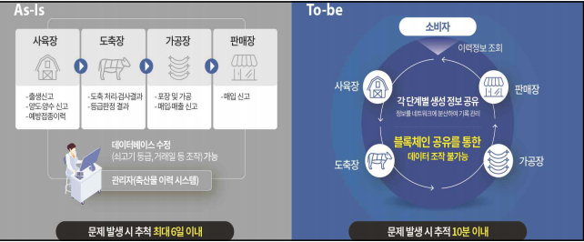
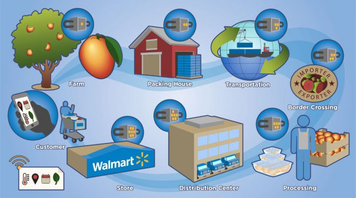
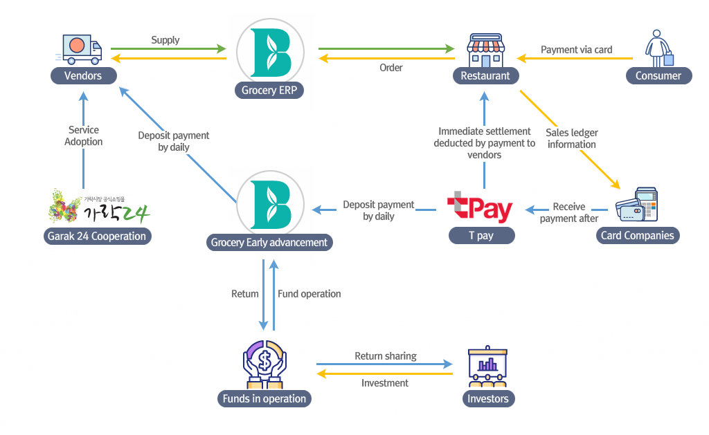

# 식품 이력관리 블록체인 사례

Created: Apr 24, 2020 11:51 AM

# 개요

식품 이력을 기존 RDB의 형태가 아닌 블록체인을 사용하여 관리하는 사례를 조사하였다.

# 사례: **블록체인과 사물인터넷을 접목한 축산물 이력관리 시스템**

2018년 「블록체인 6대 시범전략」에서 과학기술정보통신부와 농림축산식품부가 블록체인과 사물인터넷을 접목한 축산물 이력관리 시스템을 도입하겠다고 하였다.

기존 축산물 이력 시스템은 RDB를 사용하여 실시간 이력 정보를 관리하기 어려웠고, 도축검사증명서, 등급판정확인서, HACCP인증서, 친환경 인증서, 거래내역서 등 각종 증명서의 신뢰성이 낮았었다.

하지만 이러한 문제점을 축산물 이력 정보 및 증명서를 블록체인에 저장함으로써 각 지점(사육장, 도축장, 가공장, 판매장, 소비자) 별로 실시간 이력 관리 및 조회, 증명서의 신뢰성을 높힐 수 있다. 

> 그림 1. 소고기 이력관리 AS-IS, TO-BE 분석

# 사례: 월마트 이력 관리 시스템

월마트는 채소 생산자들에게 2019년 9월까지 의무적으로 블록체인을 사용하여 채소를 납품해야 한다고 선언하였다. IBM사의 Food Trust Network와 연계하여 채소 생산부터 배달까지 내역을 블록체인으로 연결하여 소비자에게 신뢰감을 줄 수 있도록 이력 관리를 하였다.

> 그림 2. 월마트 식품 이력 관리

# 사례: 블로서리

농가와 유통상인의 직거래 공급을 도와주는 선 정산 P2P 투자 플랫폼이다. 기존 농가과 유통상인은 외상 거래가 보편화되어 있어 신용 거래의 혜택이 적다. 또한 유통 구조를 거치면서 순이익을 얻기 힘든 구조인데 이러한 부분을 개선하여 유통 단계를 줄이고 블록체인을 활용한 이력 관리 및 토큰을 통한 비지니스 모델을 제공한다.

> 그림 3. 블로서리 유통 구조

# Reference

**사례: 블록체인과 사물인터넷 접목한 축산물 이력관리 시스템**

- [http://m.foodnews.co.kr/news/articleView.html?idxno=68363](http://m.foodnews.co.kr/news/articleView.html?idxno=68363)
- [http://www.mtnews.net/news/view.php?idx=4786](http://www.mtnews.net/news/view.php?idx=4786)

**식품 이력 관리 포털 & API**

- [https://www.foodsafetykorea.go.kr/apiMain.do](https://www.foodsafetykorea.go.kr/apiMain.do)
- [https://www.tfood.go.kr/tfweb/FtmsMain.do](https://www.tfood.go.kr/tfweb/FtmsMain.do)
- [https://www.foodsafetykorea.go.kr/main.do](https://www.foodsafetykorea.go.kr/main.do)

**IBM Food Trust Network**

- [https://coincode.kr/archives/5202](https://coincode.kr/archives/5202)
- [https://www.ibm.com/kr-ko/blockchain/solutions/food-trust](https://www.ibm.com/kr-ko/blockchain/solutions/food-trust)

**Blocery**

- [http://blocery.io/](http://blocery.io/)